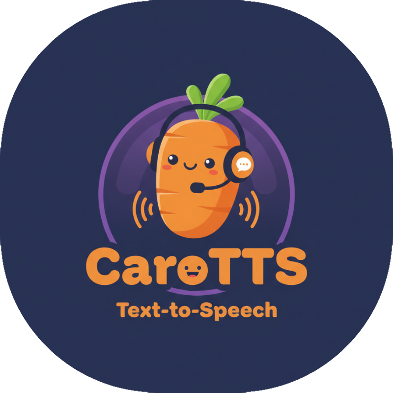

# CaroTTS 🥕

<!-- Space for carrot image -->
<p align="center">
  
</p>

**Fast, Lightweight Text-to-Speech for German** 

[](https://huggingface.co/spaces/Warholt/CaroTTS-DE)

---

## 🎯 Problem & Solution

Training and deploying high-quality Text-to-Speech (TTS) models has traditionally required significant computational resources and expertise. CaroTTS addresses this by providing:

- **Lightweight Models**: Non-autoregressive TTS models under 60M parameters
- **CPU-Friendly**: Fast inference on CPUs and even mobile devices
- **Simplified Training**: No pitch information required, reducing data preparation time
- **Train on Consumer GPUs**: Train a TTS model in under 1h on a single consumer gpu
- **Full Pipeline**: Complete workflow from data collection to deployment
- **Reproducible**: Automated training pipeline using DVC (Data Version Control)

### How It Works

CaroTTS uses a **FastPitch + HiFi-GAN** architecture:

1. **FastPitch** (Duration Predictor): Predicts the duration for each phoneme/character, enabling parallel mel-spectrogram generation instead of sequential autoregressive prediction. **Crucially, it learns pitch implicitly during training**, eliminating the need for pitch extraction during data preparation.
2. **HiFi-GAN** (Vocoder): Converts mel-spectrograms into high-quality audio waveforms

This non-autoregressive approach allows for **extremely fast inference** while maintaining high audio quality, making it practical for real-time applications on resource-constrained devices.

## ✨ Features

- 🚀 **Fast Inference**: Non-autoregressive architecture for CPU/mobile deployment
- ⚡ **Quick Setup**: No pitch extraction required during data preparation
- 📦 **Export Options**: ONNX and PyTorch Inductor (`.pt2`) export capabilities
- 🔊 **High Quality**: German language TTS with natural-sounding voices
- 🛠️ **Complete Pipeline**: Data preparation → Training → Export → Inference
- 📊 **Reproducible**: DVC-managed experiments with parameter tracking
- 🎓 **Educational**: Learn the full TTS training workflow


## 🎤 Training Data & Models

CaroTTS is trained on the **HUI-Audio-Corpus-German** dataset, a high-quality German speech corpus. We provide two trained speaker models:

- **Caro**: Available at [huggingface.co/Warholt/CaroTTS-60M-DE-Caro](https://huggingface.co/Warholt/CaroTTS-60M-DE-Caro)
- **Karlsson**: Available at [huggingface.co/Warholt/CaroTTS-60M-DE-Karlsson](https://huggingface.co/Warholt/CaroTTS-60M-DE-Karlsson)

Each model repository contains both the FastPitch and HiFi-GAN checkpoints in ONNX format for easy deployment.


## 🚀 Try It Out

Try the trained models online without any setup:

👉 **[CaroTTS Demo on HuggingFace Spaces](https://huggingface.co/spaces/Warholt/CaroTTS-DE)**


## 📋 Prerequisites

### System Requirements

- **OS**: Linux (Windows users should use WSL)
- **RAM**: At least 32 GB
- **GPU**: NVIDIA GPU with at least 8 GB VRAM (current configuration optimized for 12 GB)
- **Python**: 3.11+

### Software Dependencies

- [uv](https://github.com/astral-sh/uv) (Python package manager)
- CUDA-capable GPU drivers

## 🔧 Installation & Setup

1. **Clone the repository**
   ```bash
   git clone https://github.com/TassiloHo/CaroTTS.git
   cd CaroTTS
   ```

2. **Install dependencies**
   ```bash
   uv sync
   ```

3. **Activate the virtual environment**
   ```bash
   source .venv/bin/activate
   ```

## 🎓 Reproducing Training Results

The entire training pipeline is managed with DVC, making it simple to reproduce the results:

```bash
dvc repro
```

This single command will execute the complete pipeline:

1. **Download HUI Dataset**: Fetches and prepares the German speech data
2. **Download Pretrained Models**: Gets base models for transfer learning (Optional)
3. **Train FastPitch**: Trains the duration predictor and spectrogram generator
4. **Generate Mel-Spectrograms**: Creates training data for the vocoder
5. **Train HiFi-GAN**: Trains the neural vocoder
6. **Export to ONNX**: Exports trained models to onnx format for deployment
7. **Export to PT2-Archive**: Uses torch AOTInductor to compile and package for cuda deployments 

### Training Specific Stages

You can also run individual stages:

```bash
# Train only FastPitch for a specific speaker
dvc repro train_fastpitch@caromopfen

# Train only HiFi-GAN for a specific speaker
dvc repro train_hifigan@Karlsson
```

### Customizing Training Parameters for your GPU Memory:

Parameters are chosen for 12GB Nvidia GPUs. Edit the following parameters in `params.yaml` to suit your GPU memory.:

```yaml
speaker:
  your_speaker:
    fastpitch:
      batch_size: 16          # Training batch size
      val_batch_size: 16      # Validation batch size
      max_dur: 13             # Maximum training audio duration in seconds
      val_max_dur: 13         # Maximum validation audio duration in seconds
    hifigan:
      batch_size: 4           # Training batch size
      val_batch_size: 4       # Validation batch size
      n_train_segments: 88200 # Length of training audio segments in Hz
      val_n_segments: 131072  # Length of validation audio segments in Hz
      val_max_duration: 30    # Maximum validation audio duration in seconds
      val_min_duration: 3     # Minimum validation audio duration in seconds
```

## 🔄 Inference

### Using Pre-trained Models

Download the trained models from HuggingFace:

```bash
# Download Caro model
wget https://huggingface.co/Warholt/CaroTTS-60M-DE-Caro/resolve/main/caro_fastpitch.onnx
wget https://huggingface.co/Warholt/CaroTTS-60M-DE-Caro/resolve/main/caro_hifigan.onnx

# Or download Karlsson model
wget https://huggingface.co/Warholt/CaroTTS-60M-DE-Karlsson/resolve/main/karlsson_fastpitch.onnx
wget https://huggingface.co/Warholt/CaroTTS-60M-DE-Karlsson/resolve/main/karlsson_hifigan.onnx
```

### ONNX Inference (Recommended for Production)

ONNX inference is lightweight, fast, and doesn't require PyTorch dependencies:

```python
import numpy as np
import onnxruntime as ort
import soundfile as sf
from tokenizer import tokenize_german

# Load models
fastpitch_session = ort.InferenceSession("path/to/your/fastpitch.onnx")
hifigan_session = ort.InferenceSession("path/to/your/hifigan.onnx")

# Prepare text
text = "Hallo, ich bin CaroTTS, ein deutsches Text-zu-Sprache-System."
tokens = tokenize_german(text)

# Prepare inputs
paces = np.ones(len(tokens), dtype=np.float32)
pitches = np.zeros(len(tokens), dtype=np.float32)

inputs = {
    "text": np.array([tokens], dtype=np.int64),
    "pace": np.array([paces], dtype=np.float32),
    "pitch": np.array([pitches], dtype=np.float32),
}

# Generate spectrogram
spec = fastpitch_session.run(None, inputs)[0]

# Generate audio
audio = hifigan_session.run(None, {"spec": spec})[0]

# Save audio
sf.write("output.wav", audio.squeeze(), 44100)
```

### NeMo Inference (For Training & Development)

If you're working with the NeMo models during development:

```python
import torch
import soundfile as sf
from nemo.collections.tts.models.fastpitch import FastPitchModel
from nemo.collections.tts.models.hifigan import HifiGanModel
from tokenizer import tokenize_german

# Load models
device = "cuda" if torch.cuda.is_available() else "cpu"
fastpitch = FastPitchModel.restore_from("path/to/your/fastpitch.nemo", map_location=device).eval()
hifigan = HifiGanModel.restore_from("path/to/your/hifigan.nemo", map_location=device).eval()

# Prepare text
text = "Guten Tag. Herzlich Willkommen zu dieser Demonstration. Es stehen Ihnen zwei Stimmen zur Auswahl: Caro und Karlsson. Sie können außerdem die Sprechgeschwindigkeit anpassen. Unten finden Sie ein Paar Beispielsätze. Probieren Sie es aus!"

with torch.inference_mode():
    # Parse and generate
    parsed_text = fastpitch.parse(text)
    spec = fastpitch.generate_spectrogram(tokens=parsed_text)
    audio = hifigan.convert_spectrogram_to_audio(spec=spec)
    
    # Save audio
    sf.write("output.wav", audio.squeeze().cpu().numpy(), 44100)
```

## 🤝 Contributing

Contributions are welcome! Whether it's bug reports, feature requests, or code contributions, feel free to open an issue or pull request.

## 📝 License

[Add your license information here]

## 🙏 Acknowledgments

- Built with [NVIDIA NeMo](https://github.com/NVIDIA/NeMo)
- FastPitch architecture from ["FastPitch: Parallel Text-to-speech with Pitch Prediction"](https://arxiv.org/abs/2006.06873)
- HiFi-GAN from ["HiFi-GAN: Generative Adversarial Networks for Efficient and High Fidelity Speech Synthesis"](https://arxiv.org/abs/2010.05646)
- Data preparation uses the HUI-Audio-Corpus-German dataset

## 📧 Contact

For questions or feedback, please open an issue on GitHub or visit the [HuggingFace Space](https://huggingface.co/spaces/Warholt/CaroTTS-DE).

---

*CaroTTS - Making high-quality German TTS accessible to everyone* 🥕
